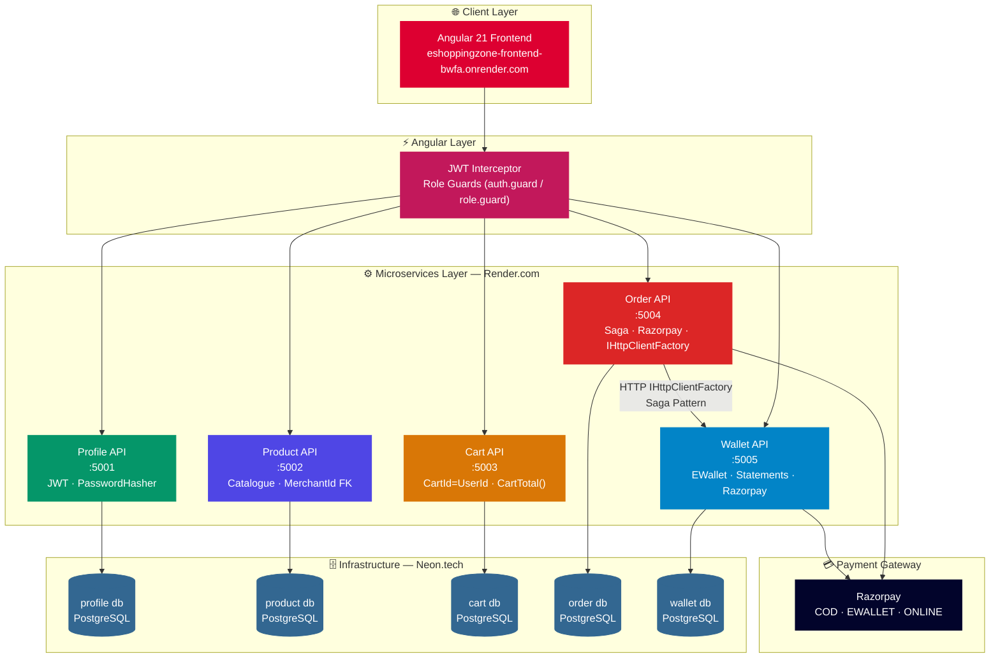
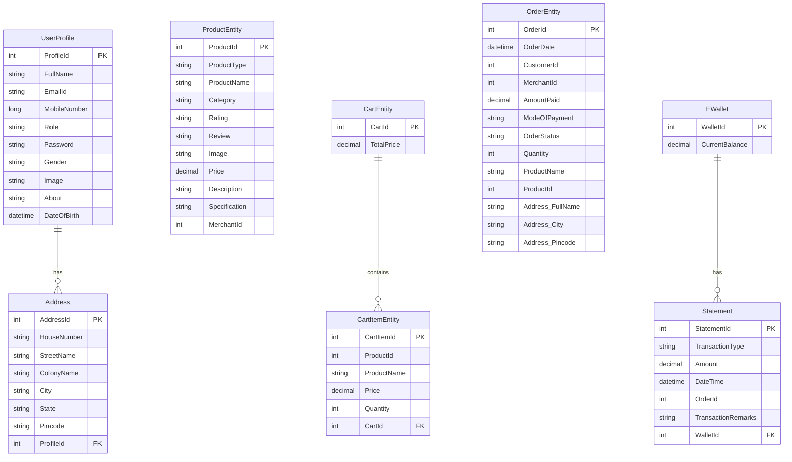
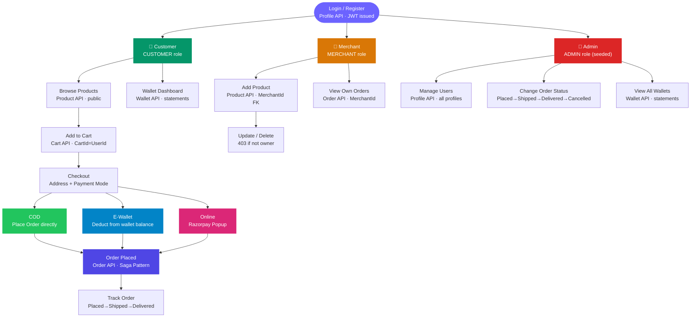
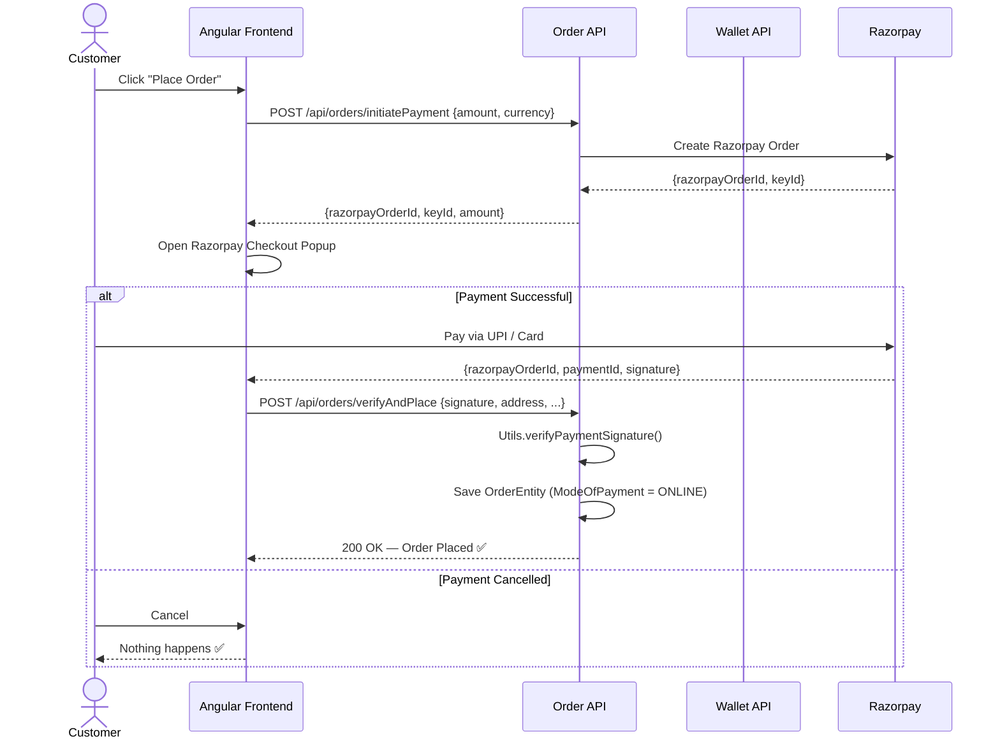
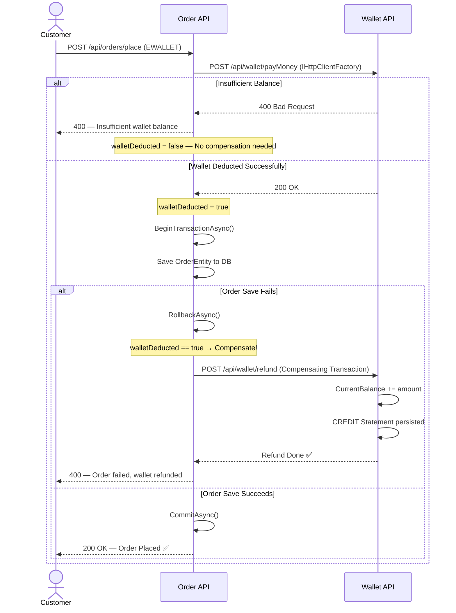
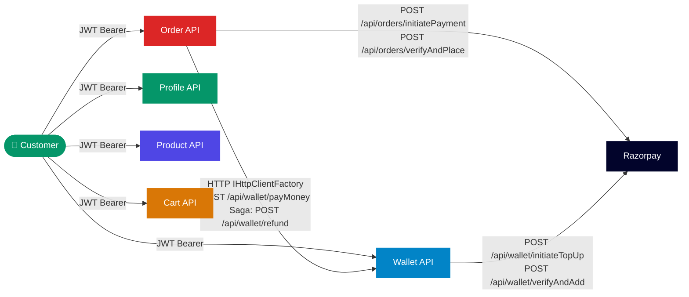

<div align="center">


# EShoppingZone

### A Production-Grade E-Commerce Platform Built on Microservices

[](https://dotnet.microsoft.com/)
[](https://angular.dev/)
[](https://www.postgresql.org/)
[](https://razorpay.com/)
[](https://nunit.org/)
[](https://render.com/)
[](https://neon.tech/)
[](LICENSE)

<p>EShoppingZone is a modern, scalable e-commerce platform engineered with a full microservices architecture — enabling customers to browse products, manage carts, place orders, and pay via COD, E-Wallet, or Razorpay online payment at scale.</p>

[Architecture](#-system-architecture) · [Microservices](#-microservices-overview) · [API Docs](#-api-reference) · [Setup](#-getting-started) · [Testing](#-testing)

---

</div>

## 🚀 Live Demo

| Service         | URL                                                |
| --------------- | -------------------------------------------------- |
| **Frontend**    | https://eshoppingzone-frontend-bwfa.onrender.com   |
| **Profile API** | https://eshoppingzone-profile.onrender.com/swagger |
| **Product API** | https://eshoppingzone-product.onrender.com/swagger |
| **Cart API**    | https://eshoppingzone-cart.onrender.com/swagger    |
| **Order API**   | https://eshoppingzone-order.onrender.com/swagger   |
| **Wallet API**  | https://eshoppingzone-wallet.onrender.com/swagger  |

### Admin Credentials (seeded automatically)

```
Email:    admin@eshoppingzone.com
Password: Admin@123
```

---

## 📋 Table of Contents

- [Tech Stack](#-tech-stack)
- [Architecture Overview](#-system-architecture)
- [UML Diagrams](#-uml-diagrams)
  - [Architecture Diagram](#1-system-architecture-diagram)
  - [Database Schema](#2-database-schema-diagram)
  - [Design Flow](#3-design-flow-diagram)
  - [Order Payment Sequence](#4-order-payment-flow)
  - [Saga Pattern Flow](#5-saga-pattern--compensating-transaction)
  - [Inter-Service Communication](#6-inter-service-communication-map)
- [Microservices Overview](#-microservices-overview)
- [Core Features](#-core-features)
- [Database Schema](#-database-schema)
- [API Reference](#-api-reference)
- [Design Patterns](#-key-design-patterns)
- [Getting Started](#-getting-started)
- [Testing](#-testing)

---

## 🛠 Tech Stack

| Layer                  | Technology                               | Purpose                                   |
| ---------------------- | ---------------------------------------- | ----------------------------------------- |
| **Backend**            | ASP.NET Core 8 Web API                   | 5 independent microservices               |
| **Frontend**           | Angular 21                               | Single-page application                   |
| **Database**           | PostgreSQL 16 (Neon.tech)                | Per-service isolated databases            |
| **ORM**                | Entity Framework Core 8                  | Code-first migrations & data access       |
| **Auth**               | JWT Bearer (HS256)                       | Stateless authentication, shared secret   |
| **Password**           | PasswordHasher\<T\> (PBKDF2+HMAC-SHA256) | Secure password hashing                   |
| **Payment**            | Razorpay                                 | COD · E-Wallet · Online (UPI/Card)        |
| **HTTP Clients**       | IHttpClientFactory                       | Typed inter-service HTTP calls            |
| **Resilience**         | Saga Pattern (Choreography)              | Distributed transaction compensation      |
| **Validation**         | Data Annotations + Regex                 | Input validation across all DTOs          |
| **Exception Handling** | Global Exception Middleware              | Safe error logging + clean JSON responses |
| **Testing**            | NUnit + Moq + FluentAssertions           | 53 unit tests                             |
| **Deployment**         | Render.com                               | Cloud production environment              |

---

## 🏗 System Architecture

EShoppingZone follows a **Microservices Architecture** with these core principles:

| Pattern                                 | Applied Where                                   |
| --------------------------------------- | ----------------------------------------------- |
| ✅ **Microservices**                    | 5 independently deployable services             |
| ✅ **Repository + Service Layer**       | Clean separation in every microservice          |
| ✅ **Dependency Injection (AddScoped)** | All services via ASP.NET Core DI                |
| ✅ **JWT Shared Secret**                | Token validated locally in all 5 APIs           |
| ✅ **Saga Pattern (Choreography)**      | Wallet deduction + order save with compensation |
| ✅ **EF Core Transactions**             | Atomic balance mutations in Wallet API          |
| ✅ **Owned Entity (OwnsOne)**           | DeliveryAddress embedded in Orders table        |
| ✅ **JSON HasConversion**               | Dictionary/IList stored as JSON in Product      |
| ✅ **Global Exception Middleware**      | Logs internally, returns safe JSON to client    |
| ✅ **DB-Per-Service**                   | Strict data isolation across all 5 services     |

---

## 📐 UML Diagrams

### 1. System Architecture Diagram

> Full deployment view — Angular Frontend → 5 Microservices → PostgreSQL Databases



---

### 2. Database Schema Diagram

> Entity relationships across all 5 isolated databases



---

### 3. Design Flow Diagram

> Complete user journey for all three roles



---

### 4. Order Payment Flow

> Sequence diagram — how a customer places an order with Razorpay



---

### 5. Saga Pattern — Compensating Transaction

> How EShoppingZone handles distributed transaction failure between Order and Wallet APIs



---

### 6. Inter-Service Communication Map

> All synchronous HTTP calls between services



**Synchronous (HTTP + IHttpClientFactory):**

```
Order.API   → Wallet.API   (POST /api/wallet/payMoney — EWALLET payment)
Order.API   → Wallet.API   (POST /api/wallet/refund — Saga compensation)
Order.API   → Razorpay     (initiatePayment + verifyAndPlace)
Wallet.API  → Razorpay     (initiateTopUp + verifyAndAdd)
```

---

## 📦 Microservices Overview

| Service         | Port | Responsibility                                                      |
| --------------- | ---- | ------------------------------------------------------------------- |
| **Profile.API** | 5001 | User registration, login, JWT generation, address management        |
| **Product.API** | 5002 | Product catalogue CRUD, category/type filtering, merchant ownership |
| **Cart.API**    | 5003 | Shopping cart, CartId=UserId, CartTotal() LINQ Sum                  |
| **Order.API**   | 5004 | Order lifecycle, Saga Pattern, Razorpay integration                 |
| **Wallet.API**  | 5005 | E-Wallet balance, atomic CREDIT/DEBIT, Razorpay top-up              |

---

## 🎯 Core Features

<details>
<summary><strong>👤 Profile & Auth</strong></summary>

- Register as Customer or Merchant via email/password
- Login with JWT token (24-hour expiry)
- Role-based access control — CUSTOMER / MERCHANT / ADMIN
- Admin seeded automatically at startup — no registration
- Profile management — bio, name, mobile, address
- Password hashing via PasswordHasher\<T\> (PBKDF2+HMAC-SHA256)
- Shared JWT secret — validated locally in all 5 APIs (no Profile API call per request)

</details>

<details>
<summary><strong>📦 Products</strong></summary>

- Add products with type, name, category, price, images, specifications
- MerchantId stored on entity — HTTP 403 if non-owner tries to update/delete
- Complex types (Dictionary, IList) stored as JSON via EF Core HasConversion
- Filter by category, type, or search by name
- Public access — no login required to browse

</details>

<details>
<summary><strong>🛒 Cart</strong></summary>

- CartId == UserId — O(1) cart lookup per authenticated user
- Add, remove, and clear cart items
- CartTotal() = `Items.Sum(i => i.Price * i.Quantity)`
- ReferenceHandler.IgnoreCycles prevents circular JSON serialization

</details>

<details>
<summary><strong>📋 Orders · 💳 Payments</strong></summary>

**Orders:** Place order with delivery address, view by customer/merchant, track status

**Payment Modes:**

- **COD** — Cash on Delivery, no payment at order time
- **EWALLET** — Deduct from internal wallet balance (Saga Pattern protects atomicity)
- **ONLINE** — Razorpay checkout popup (UPI, Card, Net Banking)

**Order Status Flow:** `Placed → Shipped → Delivered → Cancelled` (Admin only)

</details>

<details>
<summary><strong>💰 Wallet · 🔁 Saga Pattern</strong></summary>

**Wallet:** Create wallet (WalletId = UserId), add money manually or via Razorpay, view statements

**Saga Pattern (Choreography):**

- `walletDeducted` flag tracks whether wallet was debited
- If order save fails after wallet deduction → `POST /api/wallet/refund` called automatically
- All balance mutations wrapped in `BeginTransactionAsync()` for atomicity
- Every CREDIT/DEBIT persisted as Statement entity with remarks

</details>

---

## 🗄 Database Schema

Each microservice owns its own isolated PostgreSQL database — no shared DB, no cross-service joins.

| Service         | Database                | Key Tables                  | Notes                                               |
| --------------- | ----------------------- | --------------------------- | --------------------------------------------------- |
| **Profile.API** | `eshoppingzone_profile` | `UserProfiles`, `Addresses` | Email unique index, FK on Address                   |
| **Product.API** | `eshoppingzone_product` | `Products`                  | JSON columns for Dictionary/IList via HasConversion |
| **Cart.API**    | `eshoppingzone_cart`    | `Carts`, `CartItems`        | CartId = UserId, FK on CartItems                    |
| **Order.API**   | `eshoppingzone_order`   | `Orders`                    | DeliveryAddress as owned entity (OwnsOne)           |
| **Wallet.API**  | `eshoppingzone_wallet`  | `EWallets`, `Statements`    | FK Statements→EWallets                              |

---

## 🌐 API Reference

<details>
<summary><strong>🔑 Profile Endpoints — <code>/api/profiles</code></strong></summary>

| Method   | Endpoint                            | Auth  | Description               |
| -------- | ----------------------------------- | :---: | ------------------------- |
| `POST`   | `/api/profiles/register/customer`   |  ❌   | Register customer         |
| `POST`   | `/api/profiles/register/merchant`   |  ❌   | Register merchant         |
| `POST`   | `/api/profiles/login`               |  ❌   | Login — returns JWT token |
| `GET`    | `/api/profiles`                     | ADMIN | Get all profiles          |
| `GET`    | `/api/profiles/{id}`                |  ✅   | Get profile by ID         |
| `PUT`    | `/api/profiles/update`              |  ✅   | Update profile            |
| `DELETE` | `/api/profiles/{id}`                | ADMIN | Delete profile            |
| `POST`   | `/api/profiles/address`             |  ✅   | Add address               |
| `GET`    | `/api/profiles/address/{profileId}` |  ✅   | Get addresses             |

</details>

<details>
<summary><strong>📦 Product Endpoints — <code>/api/products</code></strong></summary>

| Method   | Endpoint                       |   Auth   | Description                                   |
| -------- | ------------------------------ | :------: | --------------------------------------------- |
| `GET`    | `/api/products`                |    ❌    | Get all products                              |
| `GET`    | `/api/products/{id}`           |    ❌    | Get by ID                                     |
| `GET`    | `/api/products/name/{name}`    |    ❌    | Search by name                                |
| `GET`    | `/api/products/category/{cat}` |    ❌    | Filter by category                            |
| `GET`    | `/api/products/type/{type}`    |    ❌    | Filter by type                                |
| `POST`   | `/api/products`                | MERCHANT | Add product                                   |
| `PUT`    | `/api/products`                | MERCHANT | Update product (owner only — 403 if mismatch) |
| `DELETE` | `/api/products/{id}`           | MERCHANT | Delete product (owner only)                   |

</details>

<details>
<summary><strong>🛒 Cart · 📋 Order · 💰 Wallet Endpoints</strong></summary>

**Cart — `/api/carts`**

| Method   | Endpoint                     |   Auth   | Description                   |
| -------- | ---------------------------- | :------: | ----------------------------- |
| `POST`   | `/api/carts/create`          | CUSTOMER | Create cart (CartId = UserId) |
| `GET`    | `/api/carts/{id}`            |    ✅    | Get cart by ID                |
| `GET`    | `/api/carts`                 |  ADMIN   | Get all carts                 |
| `POST`   | `/api/carts/addItem`         | CUSTOMER | Add item to cart              |
| `DELETE` | `/api/carts/removeItem/{id}` | CUSTOMER | Remove item from cart         |
| `DELETE` | `/api/carts/clear`           | CUSTOMER | Clear cart                    |

**Order — `/api/orders`**

| Method   | Endpoint                      |   Auth   | Description                    |
| -------- | ----------------------------- | :------: | ------------------------------ |
| `POST`   | `/api/orders/place`           | CUSTOMER | Place order (COD or EWALLET)   |
| `POST`   | `/api/orders/initiatePayment` | CUSTOMER | Initiate Razorpay order        |
| `POST`   | `/api/orders/verifyAndPlace`  | CUSTOMER | Verify signature + place order |
| `GET`    | `/api/orders`                 |  ADMIN   | Get all orders                 |
| `GET`    | `/api/orders/{id}`            |    ✅    | Get order by ID                |
| `GET`    | `/api/orders/customer/{id}`   | CUSTOMER | Get orders by customer         |
| `GET`    | `/api/orders/merchant/{id}`   | MERCHANT | Get orders by merchant         |
| `PUT`    | `/api/orders/status`          |  ADMIN   | Change order status            |
| `DELETE` | `/api/orders/{id}`            |    ✅    | Delete order                   |

**Wallet — `/api/wallet`**

| Method   | Endpoint                      |   Auth   | Description                          |
| -------- | ----------------------------- | :------: | ------------------------------------ |
| `POST`   | `/api/wallet/new`             | CUSTOMER | Create wallet                        |
| `GET`    | `/api/wallet/{id}`            |    ✅    | Get wallet by ID                     |
| `GET`    | `/api/wallet`                 |  ADMIN   | Get all wallets                      |
| `POST`   | `/api/wallet/addMoney`        | CUSTOMER | Add money manually                   |
| `POST`   | `/api/wallet/payMoney`        |    ✅    | Deduct from wallet                   |
| `POST`   | `/api/wallet/refund`          |    ✅    | Refund to wallet (Saga compensation) |
| `POST`   | `/api/wallet/initiateTopUp`   | CUSTOMER | Initiate Razorpay top-up             |
| `POST`   | `/api/wallet/verifyAndAdd`    | CUSTOMER | Verify + add money via Razorpay      |
| `GET`    | `/api/wallet/statements/{id}` |    ✅    | Get statements by wallet ID          |
| `GET`    | `/api/wallet/statements`      |  ADMIN   | Get all statements                   |
| `DELETE` | `/api/wallet/{id}`            |  ADMIN   | Delete wallet                        |

</details>

---

## 📊 Key Design Patterns

| Pattern                                      | Applied Where                                    |
| -------------------------------------------- | ------------------------------------------------ |
| Repository + Service Layer                   | All 5 APIs                                       |
| Dependency Injection (AddScoped)             | All services via ASP.NET Core DI                 |
| JWT Bearer (Shared Secret)                   | All 5 APIs — validated locally                   |
| EF Core Transactions (BeginTransactionAsync) | Wallet API + Order API                           |
| Owned Entity (OwnsOne)                       | Order API — DeliveryAddress embedded in Orders   |
| JSON HasConversion                           | Product API — Dictionary/IList as JSON strings   |
| Synchronous HTTP (IHttpClientFactory)        | Order API → Wallet API                           |
| Saga Pattern (Choreography)                  | Order API — wallet deduction + compensation      |
| Global Exception Middleware                  | All 5 APIs — logs internally, returns clean JSON |
| Data Annotations + Regex Validation          | All DTOs across all 5 APIs                       |

---

## 🔐 Security

- **JWT HS256** — Token signed with shared secret, 24-hour expiry
- **PasswordHasher\<T\>** — PBKDF2+HMAC-SHA256 password hashing
- **[Authorize(Roles)]** — Role-based protection on all sensitive endpoints
- **MerchantId Ownership** — HTTP 403 returned if merchant tries to edit another's product
- **Input Validation** — All DTOs validated with Data Annotations + Regex
- **EF Core Parameterized Queries** — Full SQL injection protection
- **Global Exception Middleware** — Stack traces never exposed to clients

---

## ⚡ Performance & Reliability

- **CartTotal LINQ** — `Items.Sum(i => i.Price * i.Quantity)` — computed in-memory, no round-trip
- **EF Core Transactions** — `BeginTransactionAsync()` for atomic wallet + statement operations
- **Saga Compensation** — Automatic refund if order save fails after wallet deduction
- **IgnoreCycles** — `ReferenceHandler.IgnoreCycles` prevents circular serialization in Cart + Wallet APIs
- **CartId = UserId** — O(1) cart lookup per user
- **Pagination** — List endpoints support pagination

---

## 📂 Project Structure

```
EShoppingZone/
│
├── EShoppingZone.Profile.API/
│   ├── Controllers/        ProfileController.cs
│   ├── Data/               ProfileDbContext.cs (seeds Admin)
│   ├── DTOs/               ProfileDtos.cs
│   ├── Entities/           UserProfile.cs, Address.cs
│   ├── Helpers/            JwtHelper.cs
│   ├── Middleware/         GlobalExceptionMiddleware.cs
│   ├── Repositories/       IProfileRepository.cs, ProfileRepository.cs
│   ├── Services/           IProfileService.cs, ProfileService.cs
│   ├── Program.cs
│   └── appsettings.json
│
├── EShoppingZone.Product.API/
│   ├── Entities/           ProductEntity.cs  ← renamed to avoid namespace conflict
│   ├── ...                 (same structure)
│   └── Program.cs
│
├── EShoppingZone.Cart.API/
│   ├── Entities/           CartEntity.cs, CartItemEntity.cs  ← renamed
│   ├── ...                 (same structure)
│   └── Program.cs          ← ReferenceHandler.IgnoreCycles
│
├── EShoppingZone.Order.API/
│   ├── Entities/           OrderEntity.cs, DeliveryAddress.cs  ← OwnsOne
│   ├── Services/           OrderService.cs  ← Saga Pattern + IHttpClientFactory
│   ├── ...                 (same structure)
│   └── Program.cs          ← AddHttpClient("WalletApi")
│
├── EShoppingZone.Wallet.API/
│   ├── Entities/           EWallet.cs, Statement.cs
│   ├── Services/           WalletService.cs  ← AddMoney, PayMoney, RefundMoney
│   ├── ...                 (same structure)
│   └── Program.cs          ← ReferenceHandler.IgnoreCycles
│
├── EShoppingZone.Profile.API.Tests/    → 11 tests ✅
├── EShoppingZone.Product.API.Tests/    → 10 tests ✅
├── EShoppingZone.Cart.API.Tests/       →  9 tests ✅
├── EShoppingZone.Order.API.Tests/      →  7 tests ✅
└── EShoppingZone.Wallet.API.Tests/     → 16 tests ✅
```

---

## 🚀 Getting Started

### Prerequisites

- [.NET 8 SDK](https://dotnet.microsoft.com/download)
- [PostgreSQL 16+](https://www.postgresql.org/) or [Neon.tech](https://neon.tech) account
- [pgAdmin 4](https://www.pgadmin.org/) (optional)
- [Node.js 20+](https://nodejs.org/) (for frontend)

### Clone the Repository

```bash
git clone https://github.com/YOUR_USERNAME/EShoppingZone-Backend.git
cd EShoppingZone-Backend
```

### Configure Connection Strings

Update `appsettings.json` in each API project:

```json
{
  "ConnectionStrings": {
    "ProfileDb": "Host=localhost;Port=5432;Database=eshoppingzone_profile;Username=postgres;Password=YOUR_PASSWORD;"
  },
  "Jwt": {
    "Key": "EShoppingZone_SuperSecretKey_2026_DoNotShare_MinLength32Chars!",
    "Issuer": "EShoppingZone",
    "Audience": "EShoppingZoneClients",
    "ExpiryHours": "24"
  }
}
```

### Run Migrations

```powershell
cd EShoppingZone.Profile.API && dotnet ef migrations add InitialCreate && dotnet ef database update && cd ..
cd EShoppingZone.Product.API && dotnet ef migrations add InitialCreate && dotnet ef database update && cd ..
cd EShoppingZone.Cart.API    && dotnet ef migrations add InitialCreate && dotnet ef database update && cd ..
cd EShoppingZone.Order.API   && dotnet ef migrations add InitialCreate && dotnet ef database update && cd ..
cd EShoppingZone.Wallet.API  && dotnet ef migrations add InitialCreate && dotnet ef database update && cd ..
```

### Run All 5 APIs

Open 5 separate terminals:

```powershell
cd EShoppingZone.Profile.API && dotnet run --urls "http://localhost:5001"
cd EShoppingZone.Product.API && dotnet run --urls "http://localhost:5002"
cd EShoppingZone.Cart.API    && dotnet run --urls "http://localhost:5003"
cd EShoppingZone.Order.API   && dotnet run --urls "http://localhost:5004"
cd EShoppingZone.Wallet.API  && dotnet run --urls "http://localhost:5005"
```

### Swagger URLs

| API     | URL                           |
| ------- | ----------------------------- |
| Profile | http://localhost:5001/swagger |
| Product | http://localhost:5002/swagger |
| Cart    | http://localhost:5003/swagger |
| Order   | http://localhost:5004/swagger |
| Wallet  | http://localhost:5005/swagger |

---

## 🧪 Testing

```bash
# Run all 53 tests
cd EShoppingZone
dotnet test

# Run specific test project
dotnet test EShoppingZone.Wallet.API.Tests
```

### Test Results

```
EShoppingZone.Profile.API.Tests   → 11 / 11 ✅
EShoppingZone.Product.API.Tests   → 10 / 10 ✅
EShoppingZone.Cart.API.Tests      →  9 /  9 ✅
EShoppingZone.Order.API.Tests     →  7 /  7 ✅
EShoppingZone.Wallet.API.Tests    → 16 / 16 ✅
─────────────────────────────────────────────
Total                             → 53 / 53 ✅
```

| Test Project             | Coverage Area                                                                             |
| ------------------------ | ----------------------------------------------------------------------------------------- |
| `ProfileServiceTests.cs` | RegisterCustomer, RegisterMerchant, Login (valid/invalid), GetById, GetAll, Delete        |
| `ProductServiceTests.cs` | AddProduct, GetAll, GetById, GetByName, GetByCategory, Update, Delete                     |
| `CartServiceTests.cs`    | AddCart, GetCartById, GetAllCarts, CartTotal (multiple/empty/single), UpdateCart          |
| `OrderServiceTests.cs`   | PlaceOrder COD, Persists to DB, GetAllOrders, GetByCustomerId, ChangeStatus, Delete       |
| `WalletServiceTests.cs`  | AddWallet, AddMoney, PayMoney (sufficient/insufficient), RefundMoney, GetById, Statements |

Tests use:

- **NUnit** — test framework
- **Moq** — mocks Repository and DbContext (no real PostgreSQL needed)
- **FluentAssertions** — readable assertions
- **Microsoft.EntityFrameworkCore.InMemory** — in-memory DB for tests
- **ConfigureWarnings(InMemoryEventId.TransactionIgnoredWarning)** — suppresses transaction warning in Order + Wallet tests

---

## 🌍 Deployment

### Backend — Render.com ✅

| Service     | Render URL                                 |
| ----------- | ------------------------------------------ |
| Profile API | https://eshoppingzone-profile.onrender.com |
| Product API | https://eshoppingzone-product.onrender.com |
| Cart API    | https://eshoppingzone-cart.onrender.com    |
| Order API   | https://eshoppingzone-order.onrender.com   |
| Wallet API  | https://eshoppingzone-wallet.onrender.com  |

### Database — Neon.tech ✅

5 isolated PostgreSQL databases hosted on Neon.tech free tier.

### Frontend — Render.com ✅

https://eshoppingzone-frontend-bwfa.onrender.com

```bash
# Build for production
ng build --configuration production
# Output: dist/eshoppingzone-frontend/browser/
```

### Environment Variables (per service)

```
Jwt__Key             = EShoppingZone_SuperSecretKey_2026_DoNotShare_MinLength32Chars!
Jwt__Issuer          = EShoppingZone
Jwt__Audience        = EShoppingZoneClients
Jwt__ExpiryHours     = 24
ConnectionStrings__ProfileDb = Host=...;Database=eshoppingzone_profile;...
ServiceUrls__WalletApi       = https://eshoppingzone-wallet.onrender.com  (Order API only)
Razorpay__KeyId              = rzp_test_xxxx  (Order + Wallet API)
Razorpay__KeySecret          = xxxx           (Order + Wallet API)
```

---

## 📚 Resources

- [ASP.NET Core Docs](https://docs.microsoft.com/aspnet/core)
- [Entity Framework Core Docs](https://docs.microsoft.com/ef/core)
- [Razorpay Docs](https://razorpay.com/docs/)
- [Angular Docs](https://angular.dev/)
- [Neon.tech Docs](https://neon.tech/docs)
- [NUnit Docs](https://docs.nunit.org/)

---

<div align="center">

Made with ❤️ · EShoppingZone — Browse. Add to Cart. Order. Pay. Effortlessly.

</div>
